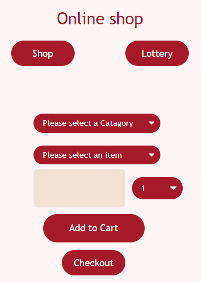
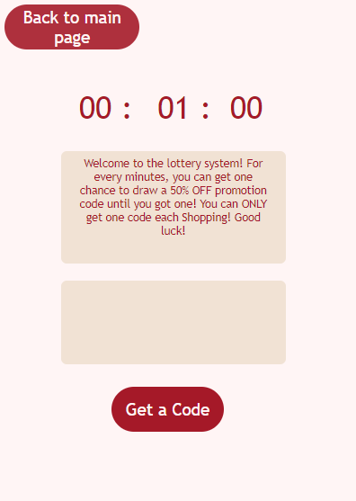
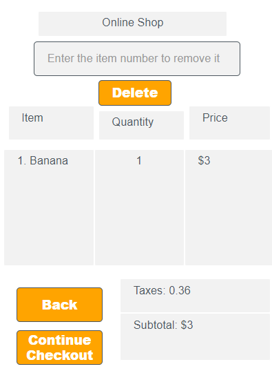
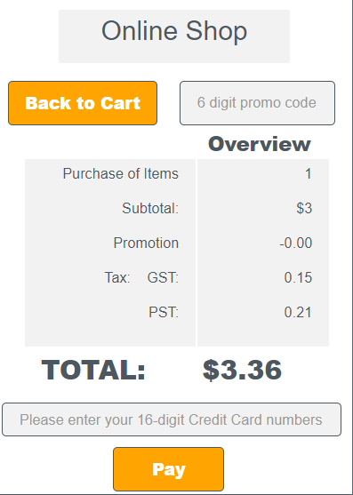
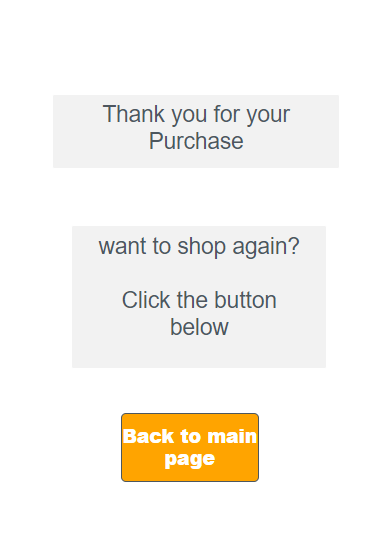
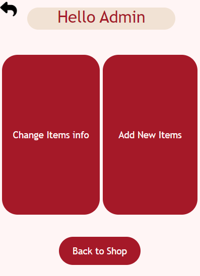
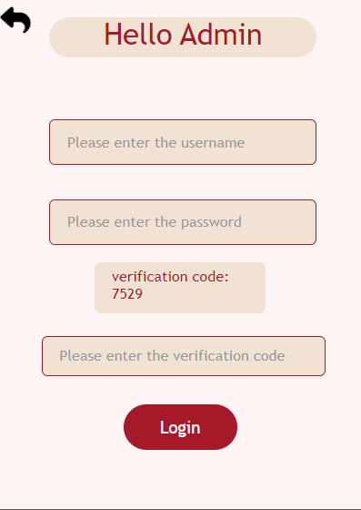
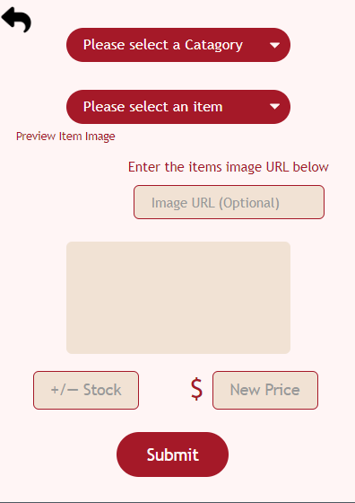
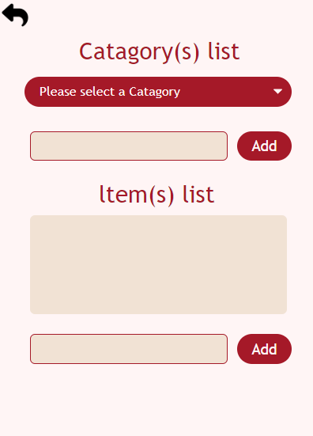

# Online Shop

## Project Link

You can view the project on [Code.org](https://studio.code.org/projects/applab/xDnl0XFYiyEvdhjrfpn83pwUAya-7TtdHykUT6WHsvs).

## Project Description

This project is an online shopping platform designed to make users' lives more convenient during the pandemic. Users can shop online, and administrators can easily manage products through a console. Key features include:
- Adding and removing items from the cart
- Validating credit card numbers
- Tracking stock quantities
- Earning promo codes through a lottery system
- Admin console for managing products


## Features

1. **Shopping Cart Management**: Users can add and remove items from their cart, ensuring they do not exceed available stock.
2. **Credit Card Validation**: The system checks for valid credit card numbers during checkout.
3. **Stock Management**: Admins can manage product stock and pricing through a console interface.
4. **Promo Code System**: Users can earn promo codes through a lottery section for discounts.
5. **Admin Console**: Admins can log in to add new products or update existing ones.

## How to use
You can paste the embed code into an HTML page to display the project on a webpage.
```html
<iframe width="392" height="620" style="border: 0px;" src="https://studio.code.org/projects/applab/uhcPOSCda3ny1iUD8Yc9vYAxw3I-NMX1e3HxMbBegyg/embed?nosource"></iframe>
```

## Usage

1. **Shopping**: Select a category and item, specify the quantity, and add items to your cart.
2. **Checkout**: Click on the checkout button to proceed with payment. Enter your credit card details for validation.
3. **Promo Codes**: Visit the lottery section to try and earn a promo code.
4. **Admin Access**: 
   - Click the "Lottery" button on the start screen.
   - Enter `//admin//` in the promo code output text area.
   - Log in with username `admin` and password `12345`.

## Demo

Here are some screenshots of the application:

### Start Screen


### Lottery Screen (No Code)


### Cart Screen


### Checkout Screen


### Final Screen


### Admin Main Screen


### Admin Login Screen


### Admin Add Stock Screen


### Admin Category Screen


## File Structure

- `index.html`: The main HTML file containing the structure of the web application.
- `code.js`: JavaScript file with all the functionalities and event handlers.

## Author

+ **Zhengyu (Joey) Wang**

## Acknowledgements

- [Code.org](https://code.org) for providing the platform to build this project.

## License

This project is licensed under the GNU General Public License v3.0. See the [LICENSE](./LICENSE) file for details.

